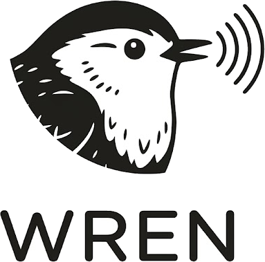

<p align="center">
  <picture>
    <source media="(prefers-color-scheme: dark)" srcset="assets/wren-wordmark-dark.png">
    
  </picture>
</p>

<p align="center">
  <strong>Lightweight, private, provider-agnostic voice-to-text for the desktop.</strong><br>
  Speak, and the text appears wherever your cursor is.
</p>

<p align="center">
  <a href="LICENSE"></a>
  
  
  
</p>

---

## What is Wren?

Wren is a desktop dictation (speech-to-text) app that treats **every
transcription engine as a swappable backend**. Press a global shortcut, speak,
and the transcribed text is typed wherever your cursor is. The transcription can
come from an **external API** (cloud), a **local server**, or an **embedded
engine** (fully offline, one-click model download), all behind the same
interface, so the app is never locked to any single provider.

The name comes from the wren (Portuguese *corruíra*) — a tiny, discreet,
homely bird with a voice that's powerful for its size. That's the project in a
nutshell: **light and unassuming, but with a strong voice.**

## Why Wren?

Local-only dictation apps refuse, by design, to send audio to a cloud API;
cloud apps lock you into a single provider. Wren sits in the middle: **you pick
the provider** (cloud, local server, or embedded) and the app couples to none of
them.

- **Private by default.** Your audio stays local unless *you* point Wren at a
  cloud provider — and the UI tells you, per provider, whether audio leaves your
  machine.
- **Provider-agnostic.** Cloud API, local server, or embedded model — same
  interface. Switch freely, or run fully offline.
- **Light on resources.** Built on Tauri v2 with a disposable webview: when
  idle, only the small Rust process stays resident. The recording bubble is
  rendered natively (wgpu), not in a browser.
- **Yours to shape.** Global shortcut, push-to-talk or toggle, pause
  compression, feedback sounds, launch-at-login, and a searchable history with
  per-run telemetry.

## Features

- 🎙️ **Global-shortcut dictation** — toggle or push-to-talk activation.
- 🔌 **Swappable providers** — OpenAI-compatible cloud APIs, local servers, or
  offline models, selected at runtime.
- 📦 **Offline models** — one-click download and activation of embedded
  speech-to-text models.
- 🔒 **Egress transparency** — every provider is labeled *Local* or *External*
  so you always know where your audio goes.
- 🕘 **History & diagnostics** — searchable transcription history plus a
  per-stage performance telemetry view.
- 🌐 **Internationalized UI** — English by default, with a Portuguese (pt-BR)
  locale included.

## Install

> Wren is pre-1.0 and under active development. Pre-built binaries will be
> published on the [Releases](https://github.com/rafaelvieiras/wren/releases)
> page as they become available. For now, build from source (below).

## Build from source

**Prerequisites**

- [Rust](https://www.rust-lang.org/tools/install) (stable toolchain)
- [Node.js](https://nodejs.org/) 20+ and npm
- Tauri v2 system dependencies for your OS — see the
  [Tauri prerequisites guide](https://v2.tauri.app/start/prerequisites/)

**Run the app in development**

```bash
git clone https://github.com/rafaelvieiras/wren.git
cd wren/apps/desktop
npm install
npm run app          # tauri dev: native shell + UI
```

**Other useful commands**

```bash
# From apps/desktop:
npm run dev:mock     # UI only, with a mocked backend (no Tauri) at localhost:5173
npm run build        # typecheck + build the web UI
npm run tauri build  # produce a release bundle for your platform

# From the repository root:
cargo build          # build all Rust crates
cargo test           # run the test suite
cargo clippy         # lint the Rust code
```

## Architecture

Wren uses a hexagonal (ports-and-adapters) layout so the domain never depends on
any concrete engine, audio backend, or OS integration:

| Crate / package | Responsibility |
| --- | --- |
| `crates/wren-core` | Domain model, ports (traits), and use-cases — no I/O. |
| `crates/wren-adapters` | Concrete adapters: audio capture (cpal), VAD, remote transcriber, paste text-sink, storage, telemetry, logging. |
| `crates/wren-embedded` | Offline inference: a worker process, model management, and the embedded transcriber. |
| `crates/wren-bench` | A CLI benchmark for comparing transcription quality/latency. |
| `apps/desktop` | The Tauri v2 app: Rust shell (tray, global shortcut, native recording bubble) + a React/TypeScript settings UI. |

The desktop UI is only the settings window; the recording indicator is a native
wgpu overlay, so no webview is resident while you dictate.

## Contributing

Contributions are welcome! Please read [CONTRIBUTING.md](CONTRIBUTING.md) for
how to set up your environment, the commands to run, and our conventions. If
you're using an AI coding agent, see [AGENTS.md](AGENTS.md).

By participating, you agree to abide by our
[Code of Conduct](CODE_OF_CONDUCT.md). To report a security issue, see
[SECURITY.md](SECURITY.md).

## License

Licensed under the [MIT License](LICENSE).
